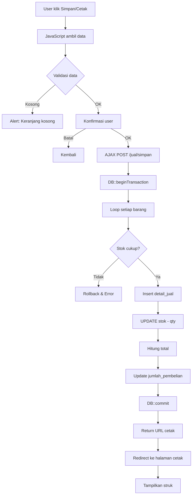

# 🛒 SISTEM TRANSAKSI PENJUALAN - FITUR SIMPAN/CETAK

> **Laravel Point of Sale (POS) System dengan Automatic Stock Deduction**

## 📋 OVERVIEW

Sistem ini memungkinkan kasir untuk:

-   ✅ Membuat transaksi penjualan
-   ✅ Menambahkan barang ke keranjang
-   ✅ **Menyimpan transaksi & mengurangi stok otomatis**
-   ✅ Mencetak struk pembayaran

---

## 🎯 FITUR UTAMA

### ⭐ PENGURANGAN STOK OTOMATIS

-   Stok barang **otomatis berkurang** saat transaksi disimpan
-   Menggunakan **Database Transaction** untuk keamanan
-   **Validasi stok** sebelum transaksi
-   **Rollback otomatis** jika terjadi error

### 🔒 KEAMANAN

-   CSRF Protection
-   SQL Injection Prevention
-   Input Validation
-   Authorization Check
-   Error Handling

### 🚀 PERFORMA

-   Atomic database operation
-   Optimized query
-   Transaction management
-   Logging & Monitoring

---

## 📂 STRUKTUR FILE

```
📦 Project
├── 📄 DOKUMENTASI_SIMPAN_CETAK.md  ← Dokumentasi lengkap
├── 📄 QUICK_REFERENCE.md           ← Cheatsheet
├── 📄 TESTING_GUIDE.md             ← Panduan testing
├── 📄 FAQ.md                       ← Pertanyaan umum
├── 📄 CONTROLLER_EXAMPLE.php       ← Contoh kode controller
├── 📄 ROUTES_EXAMPLE.php           ← Contoh route
├── 📄 JAVASCRIPT_EXAMPLE.js        ← Contoh JavaScript
│
├── app/Http/Controllers/
│   └── JualController.php          ⭐ Controller utama
│
├── routes/
│   └── web.php                     ⭐ Route definition
│
└── resources/views/jual/
    ├── detail_jual.blade.php       ⭐ Halaman input
    └── cetak.blade.php             ⭐ Halaman struk
```

---

## 🚀 QUICK START

### 1. Setup Database

```bash
php artisan migrate
php artisan db:seed
```

### 2. Jalankan Server

```bash
php artisan serve
```

### 3. Akses Aplikasi

```
http://127.0.0.1:8000/jual/create
```

### 4. Alur Penggunaan

1. Pilih pelanggan
2. Tambahkan barang ke keranjang
3. Klik **"Simpan/Cetak"**
4. Konfirmasi
5. ✅ Stok otomatis berkurang!
6. Struk tampil

---

## 💻 KODE INTI

### Controller (JualController.php)

```php
public function simpan(Request $request)
{
    DB::beginTransaction();
    try {
        foreach ($request->dataBarang as $barang) {
            // Validasi stok
            if ($barangData->stok < $barang['qty']) {
                throw new \Exception("Stok tidak cukup");
            }

            // Simpan detail
            DB::table('detail_jual')->insert([...]);

            // ⭐ KURANGI STOK
            DB::table('barang')
                ->where('id', $barang['barang_id'])
                ->update(['stok' => DB::raw('stok - ' . $barang['qty'])]);
        }

        DB::commit();
        return response()->json(['berhasil' => true, ...]);
    } catch (\Throwable $e) {
        DB::rollback();
        return response()->json(['berhasil' => false, ...]);
    }
}
```

### Route (web.php)

```php
Route::post('/jual/simpan', [JualController::class, 'simpan']);
Route::get('/jual/cetak/{id}', [JualController::class, 'cetak']);
```

### JavaScript (detail_jual.blade.php)

```javascript
$(".simpan").click(function () {
    // Ambil data dari tabel
    // Validasi
    // Konfirmasi
    // AJAX ke /jual/simpan
    // Redirect ke cetak
});
```

---

## 🗄️ DATABASE SCHEMA

```sql
-- Master Barang
barang:
  - id
  - nama_barang
  - harga_jual
  - stok ⭐ (dikurangi otomatis)

-- Master Transaksi
jual:
  - id
  - tanggal
  - pelanggan_id
  - jumlah_pembelian ⭐ (total)

-- Detail Transaksi
detail_jual:
  - id
  - jual_id
  - barang_id
  - qty ⭐ (mengurangi stok)
  - harga_sekarang
```

---

## 📊 ALUR PROSES



---

## 🧪 TESTING

### Manual Testing

```bash
# 1. Tambahkan barang ke keranjang
# 2. Klik Simpan/Cetak
# 3. Cek database
```

### Database Check

```sql
-- Cek stok berkurang
SELECT id, nama_barang, stok FROM barang WHERE id = 1;

-- Cek transaksi tersimpan
SELECT * FROM detail_jual WHERE jual_id = 160;
```

### Log Check

```bash
tail -f storage/logs/laravel.log
```

---

## 📚 DOKUMENTASI LENGKAP

| File                                                       | Deskripsi                                    |
| ---------------------------------------------------------- | -------------------------------------------- |
| [DOKUMENTASI_SIMPAN_CETAK.md](DOKUMENTASI_SIMPAN_CETAK.md) | Dokumentasi lengkap dengan penjelasan detail |
| [QUICK_REFERENCE.md](QUICK_REFERENCE.md)                   | Cheatsheet untuk reference cepat             |
| [TESTING_GUIDE.md](TESTING_GUIDE.md)                       | Panduan testing lengkap                      |
| [FAQ.md](FAQ.md)                                           | Pertanyaan yang sering ditanyakan            |
| [CONTROLLER_EXAMPLE.php](CONTROLLER_EXAMPLE.php)           | Contoh kode controller                       |
| [ROUTES_EXAMPLE.php](ROUTES_EXAMPLE.php)                   | Contoh route definition                      |
| [JAVASCRIPT_EXAMPLE.js](JAVASCRIPT_EXAMPLE.js)             | Contoh JavaScript/jQuery                     |

---

## ⚠️ PENTING!

### ✅ DO's (Yang Harus Dilakukan)

-   ✅ Selalu gunakan `DB::transaction`
-   ✅ Validasi stok sebelum transaksi
-   ✅ Ambil harga dari database, bukan dari user input
-   ✅ Disable tombol setelah klik untuk prevent double submit
-   ✅ Log setiap perubahan stok
-   ✅ Test di staging sebelum production

### ❌ DON'Ts (Yang Harus Dihindari)

-   ❌ Jangan kurangi stok tanpa transaction
-   ❌ Jangan percaya input user untuk harga
-   ❌ Jangan lupa rollback saat error
-   ❌ Jangan deploy tanpa testing
-   ❌ Jangan hardcode nilai statis
-   ❌ Jangan skip validasi

---

## 🐛 TROUBLESHOOTING

### Stok tidak berkurang?

```php
// Cek apakah query dijalankan
\Log::info("Query stok untuk barang ID: " . $barang['barang_id']);

// Cek apakah commit dipanggil
DB::commit();
\Log::info("Transaction committed");
```

### Error 500?

```bash
# Cek log
tail -f storage/logs/laravel.log

# Enable debug
# .env: APP_DEBUG=true
```

### Tombol tidak bekerja?

```javascript
// Buka Console Browser (F12)
// Cek error JavaScript
console.log("Data:", dataBarang);
```

---

## 🔐 SECURITY CHECKLIST

-   [x] CSRF Token aktif
-   [x] Parameter binding (SQL Injection prevention)
-   [x] Input validation
-   [x] Stok validation
-   [x] Authorization check
-   [x] Error handling
-   [x] Logging enabled

---

## 📈 PERFORMANCE TIPS

1. **Index Database**

    ```sql
    ALTER TABLE detail_jual ADD INDEX idx_jual_id (jual_id);
    ALTER TABLE detail_jual ADD INDEX idx_barang_id (barang_id);
    ```

2. **Bulk Insert** (untuk banyak item)

    ```php
    DB::table('detail_jual')->insert($arrayData);
    ```

3. **Eager Loading** (untuk view)
    ```php
    $djual = DetailJual::with('barang')->get();
    ```

---

## 🎓 LEARNING RESOURCES

-   [Laravel Transactions](https://laravel.com/docs/database#database-transactions)
-   [Eloquent ORM](https://laravel.com/docs/eloquent)
-   [Query Builder](https://laravel.com/docs/queries)
-   [AJAX with Laravel](https://laravel.com/docs/requests#ajax-requests)

---

## 👥 TEAM & SUPPORT

-   **Developer:** [Your Name]
-   **Project:** Praktikum Web Programming
-   **Semester:** 5
-   **Date:** December 2025

---

## 📝 VERSION HISTORY

### Version 1.0.0 (December 2025)

-   ✅ Initial release
-   ✅ Fitur simpan/cetak aktif
-   ✅ Pengurangan stok otomatis
-   ✅ Database transaction
-   ✅ Validasi stok
-   ✅ Error handling
-   ✅ Logging

---

## 🎉 STATUS

```
✅ SISTEM READY FOR PRODUCTION!
```

### Features Completed:

-   [x] Tombol Simpan/Cetak berfungsi
-   [x] Pengurangan stok otomatis
-   [x] Validasi stok mencukupi
-   [x] Database transaction
-   [x] Error handling
-   [x] Halaman cetak struk
-   [x] Logging & monitoring
-   [x] Security measures
-   [x] Documentation lengkap
-   [x] Testing guide

---

## 🚀 NEXT STEPS

1. ✅ Testing di berbagai skenario
2. ✅ Review kode
3. ✅ Backup database
4. ✅ Deploy ke staging
5. ✅ User acceptance testing
6. ✅ Production deployment
7. ✅ Monitoring & maintenance

---

## 📞 CONTACT

Untuk pertanyaan atau issue, silakan:

-   Cek [FAQ.md](FAQ.md) terlebih dahulu
-   Review [DOKUMENTASI_SIMPAN_CETAK.md](DOKUMENTASI_SIMPAN_CETAK.md)
-   Cek log di `storage/logs/laravel.log`

---

**Happy Coding! 🎉**

---

_Last Updated: December 23, 2025_
